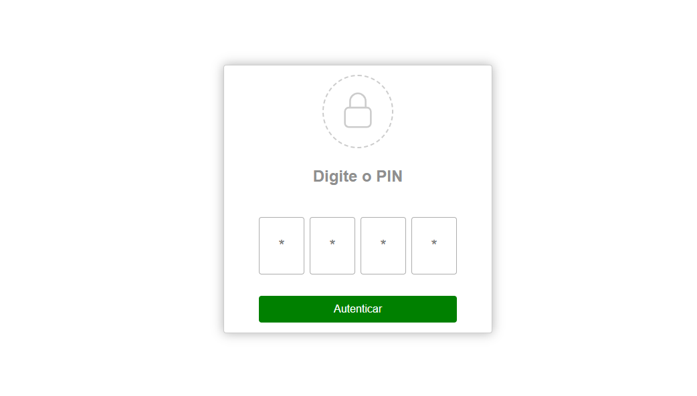

<h1>Sistema de Verificação de PIN</h1> 

 

<h2>Visão Geral</h2>

Este projeto implementa um sistema de verificação de PIN (Número de Identificação Pessoal) baseado em JavaScript, com interativo para os usuários. O sistema fornece dicas aos usuários com base em se o PIN inserido é maior ou menor que o correto.
  

<h2>Estrutura do Projecto</h2> 
<ul>
    <li>index.html: O arquivo HTML principal contendo a estrutura do sistema de verificação de PIN.</li>
    <li>styles/main.css: Arquivo CSS para estilizar o projeto.</li> 
    <li>script/app.js: Arquivo JavaScript para a lógica de verificação do PIN.</li> 
    <li>img: Pasta onde tem as imagens</li> 
</ul> 

<h2>Estrutura do HTML</h2>

O arquivo HTML inclui uma seção de entrada de PIN com quatro campos de entrada, um botão de envio e três diálogos para sucesso, erro de entrada e feedback de PIN incorreto.
 

<h2>Estilo CSS</h2>

O arquivo CSS (main.css) está vinculado ao arquivo HTML para fornecer estilos para uma interface limpa e amigável ao usuário.
 

<h2>Lógica JavaScript</h2>

O arquivo JavaScript (app.js) contém a lógica para a verificação do PIN. Ele usa a API DOM para lidar com interações do usuário, validar a entrada e fornecer feedback por meio de diálogos.
 

<h2>Lógica de Verificação do PIN</h2> 
<ol>
  <li><strong>Ouvintes de Eventos:</strong> O script escuta o evento DOMContentLoaded e o evento de clique no botão de envio.</li>
  <li><strong>Recuperação da Entrada do Usuário:</strong> O PIN inserido pelo usuário é recuperado dos campos de entrada.</li>
  <li><strong>Geração de Feedback:</strong> Se o PIN inserido for maior ou menor que o correto, uma mensagem de feedback correspondente é exibida.</li>
  <li><strong>Validação da Entrada:</strong> O script verifica se todos os campos de entrada estão preenchidos. Se não estiverem, é exibido um diálogo de erro.</li>
  <li><strong>Processamento e Exibição de Diálogo:</strong> Se todos os campos estiverem preenchidos, um indicador de carregamento é exibido durante o processamento da entrada. Após um atraso, o sistema verifica se o PIN inserido está correto, exibindo diálogos de sucesso ou erro conforme apropriado.</li>
</ol>

<h2>
  Diálogos

</h2>
<ul>
  <li><strong>Diálogo de Sucesso:</strong> Exibe uma mensagem de parabéns quando o PIN correto é inserido.</li>
  <li><strong>Diálogo de Erro de Entrada:</strong> Solicita ao usuário que preencha todos os campos de entrada quando alguns são deixados em branco.</li>
  <li><strong>Diálogo de PIN Incorreto:</strong> Notifica o usuário sobre um PIN incorreto com uma dica e o PIN correto para referência.</li>
</ul> 

<h2>Uso</h2> 

<ol>
  <li><strong>Uso</strong></li>
  <li>Abra <code>index.html</code> em um navegador da web.</li>
  <li>Insira um PIN de quatro dígitos.</li>
  <li>Clique no botão "Autenticar".</li>
  <li>Receba feedback por meio de diálogos com base na correção do PIN inserido.</li>
</ol>

<h2>Notas Adicionais</h2> 
<ol>
  <li><strong>Notas Adicionais</strong></li>
  <li>O PIN a ser verificado está atualmente definido como "1234" e pode ser modificado no arquivo JavaScript.</li>
  <li>O estilo e a aparência podem ser personalizados ao modificar o arquivo CSS.</li>
</ol>

